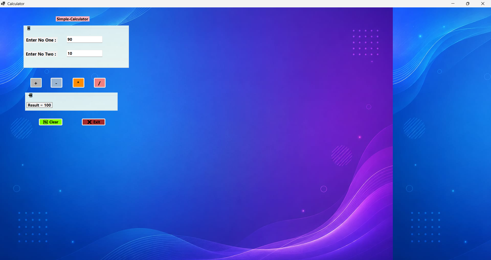

<h2>  </h2>

<div align="center">

<p align="center">

</p>
<br/>

<!-- TECH BADGES -->
[](https://learn.microsoft.com/en-us/dotnet/csharp/)
[](https://dotnet.microsoft.com/)
[](https://learn.microsoft.com/en-us/dotnet/desktop/winforms/)
[](https://visualstudio.microsoft.com/)
[](https://www.microsoft.com/windows)

<br/>

<!-- STATS BADGES -->
[](LICENSE)
[](https://github.com/dhruvprajapati6)

</div>

---

## 📋 Table of Contents

<details>
<summary>📖 <strong>Click to expand the full Table of Contents</strong></summary>

| # | Section |
|---|---------|
| 1 | [🔭 About The Project](#-about-the-project) |
| 2 | [✨ Key Features](#-key-features) |
| 3 | [📷 App Screenshots](#-app-screenshots) |
| 4 | [🛠️ Technologies Used](#️-technologies-used) |
| 5 | [📂 Project Structure](#-project-structure) |
| 6 | [⚙️ Getting Started](#️-getting-started) |
| 7 | [🚀 How To Run](#-how-to-run) |
| 8 | [📖 Usage Guide](#-usage-guide) |
| 9 | [🔮 Future Roadmap](#-future-roadmap) |
| 10 | [🤝 Contributing](#-contributing) |
| 11 | [📜 License](#-license) |
| 12 | [👨‍💻 Developer](#-developer) |
| 13 | [📬 Contact](#-contact) |

</details>

---

## 🔭 About The Project

<table>
<tr>
<td>

> **C# Simple Calculator** is a clean, responsive, and modern **Windows Forms desktop application** built with **C# .NET Framework**. Designed with simplicity and performance in mind, it delivers fast arithmetic calculations through an attractive and intuitive interface.
>
> Whether you're a student learning C#, a developer exploring Windows Forms, or just looking for a reliable desktop calculator — this project is your perfect reference!

</td>
</tr>
</table>

### 🎯 Project Highlights

```
✔ Clean codebase — Easy to read, modify, and extend
✔ Beginner to Intermediate level C# code
✔ Real-world Windows Forms UI design patterns
✔ Input validation to prevent runtime errors
✔ Well-structured project for portfolio showcasing
```

---

## ✨ Key Features

<div align="center">

| 🟦 Feature | 📝 Description | 🔖 Status |
|:----------:|:--------------|:---------:|
| ➕ **Addition** | Instantly adds two numbers | `✅ Live` |
| ➖ **Subtraction** | Subtracts values with precision | `✅ Live` |
| ✖️ **Multiplication** | Fast multiplication of any numbers | `✅ Live` |
| ➗ **Division** | Division with zero-check validation | `✅ Live` |
| 🛡️ **Input Validation** | Prevents crashes from invalid input | `✅ Live` |
| 🗑️ **Clear Button** | Reset everything with one click | `✅ Live` |
| ❌ **Exit Button** | Graceful application shutdown | `✅ Live` |
| 🎨 **Modern UI** | Clean Windows Forms design | `✅ Live` |
| ⚡ **Performance** | Near-instant calculation results | `✅ Live` |
| 🔰 **Beginner Friendly** | Well-commented, readable code | `✅ Live` |

</div>

---

## 📷 App Screenshots

<div align="center">

### 🖥️ Home Screen — Enter Numbers



> _Enter two numbers and select an arithmetic operation_

---

## 🛠️ Technologies Used

<div align="center">

| 🔧 Technology | 💡 Purpose | 🔗 Version |
|:------------:|:----------|:---------:|
|  | Core programming language | C# 9.0+ |
|  | Application runtime environment | 4.8 |
|  | Desktop GUI framework | Built-in |
|  | Integrated Development Environment | 2022 |
|  | Version control system | Latest |
|  | Code hosting & collaboration | — |

</div>

---

## 📂 Project Structure

```
📦 CSharp-Calculator/
│
├── 📄 Calculator.sln              ← Visual Studio Solution File
├── 📄 README.md                   ← You are here! 📍
├── 📄 LICENSE                     ← MIT License
│
├── 📁 Calculator/
│   ├── 📄 Program.cs              ← Application Entry Point
│   ├── 📄 Form1.cs                ← Main Calculator Logic & Events
│   ├── 📄 Form1.Designer.cs       ← Auto-generated UI Layout Code
│   ├── 📄 App.config              ← Application Configuration
│   └── 📄 Calculator.csproj       ← Project Configuration File
│
└── 📁 images/
    ├── 🖼️ calculator-home.png     ← Home Screen Screenshot
    └── 🖼️ calculator-result.png   ← Result Screen Screenshot
```

---

## ⚙️ Getting Started

### 📋 Prerequisites

Before running this project, ensure the following are installed on your system:

- ✅ **Windows OS** (Windows 10 / 11 recommended)
- ✅ **Visual Studio 2019 or 2022** → [Download Here](https://visualstudio.microsoft.com/)
  - Workload: `.NET desktop development` must be enabled
- ✅ **.NET Framework 4.8** → [Download Here](https://dotnet.microsoft.com/en-us/download/dotnet-framework)
- ✅ **Git** → [Download Here](https://git-scm.com/downloads)

---

## 🚀 How To Run

### 🔁 Step 1 — Clone the Repository

```bash
# Clone via HTTPS
git clone https://github.com/dhruvprajapati6/CSharp-Calculator.git

# Or clone via SSH
git clone git@github.com:dhruvprajapati6/CSharp-Calculator.git

# Navigate into the project folder
cd CSharp-Calculator
```

### 🗂️ Step 2 — Open in Visual Studio

```
1. Launch Visual Studio 2019 / 2022
2. Click "Open a project or solution"
3. Navigate to the cloned folder
4. Select "Calculator.sln"
5. Wait for the project to load
```

### ▶️ Step 3 — Build & Run

```
Option A: Press F5                    → Builds and runs with debugger
Option B: Press Ctrl + F5             → Builds and runs without debugger
Option C: Click ▶ Start button        → In the Visual Studio toolbar
```

> 🎉 **That's it!** The Calculator window will appear instantly.

---

## 📖 Usage Guide

```
🔢 Step 1 → Enter the first number in the input field
🔢 Step 2 → Enter the second number in the input field
🔘 Step 3 → Click the desired operation button:
            [ + ]  Addition
            [ - ]  Subtraction
            [ × ]  Multiplication
            [ ÷ ]  Division
📊 Step 4 → View the result in the result field
🗑️ Step 5 → Press [Clear] to reset and start over
❌ Step 6 → Press [Exit] to close the application
```

> ⚠️ **Note:** The calculator handles division by zero gracefully and shows a proper error message.

---

## 🔮 Future Roadmap

Here's what's planned for upcoming versions of this project:

```
Version 2.0 — Enhanced UI
```

- [ ] 🌙 **Dark Mode** — Toggle between light & dark themes
- [ ] 🎨 **Custom Themes** — Multiple color palettes to choose from
- [ ] 📱 **Responsive Resizing** — Auto-scale for different screen sizes

```
Version 3.0 — Advanced Features
```

- [ ] 🧮 **Scientific Calculator** — sin, cos, tan, log, sqrt, power
- [ ] 📜 **Calculation History** — View and reuse past calculations
- [ ] ⌨️ **Keyboard Shortcuts** — Full keyboard input support
- [ ] 💾 **Export to File** — Save history as `.txt` or `.csv`

```
Version 4.0 — Modern Rewrite
```

- [ ] 🪟 **WPF Migration** — Rewrite using Windows Presentation Foundation
- [ ] 🌐 **Web Version** — ASP.NET Core web calculator
- [ ] 📦 **Installer** — One-click `.exe` installer for easy distribution

---

## 🤝 Contributing

Contributions make the open-source community amazing! 💙

Any contribution you make is **greatly appreciated**.

```bash
# Step 1: Fork the project on GitHub
# (Click the "Fork" button at the top right of this page)

# Step 2: Clone your forked repository
git clone https://github.com/YOUR_USERNAME/CSharp-Calculator.git

# Step 3: Create a new feature branch
git checkout -b feature/YourAmazingFeature

# Step 4: Make your changes and commit
git commit -m "✨ Add: YourAmazingFeature"

# Step 5: Push your branch to GitHub
git push origin feature/YourAmazingFeature

# Step 6: Open a Pull Request on GitHub 🚀
```

> 💡 **Tip:** Check [open issues](https://github.com/dhruvprajapati6/CSharp-Calculator/issues) for good first contributions!

---

## 📜 License

```
MIT License

Copyright (c) 2024 Dhruv Prajapati

Permission is hereby granted, free of charge, to any person obtaining a copy
of this software to use, copy, modify, merge, and distribute — subject to the
following conditions:

The above copyright notice and this permission notice shall be included in
all copies or substantial portions of the Software.

THE SOFTWARE IS PROVIDED "AS IS", WITHOUT WARRANTY OF ANY KIND.
```

Distributed under the **MIT License**. See [`LICENSE`](LICENSE) for full details.

---

## 👨‍💻 Developer

<div align="center">


### 🌟 Dhruv Prajapati

**`BCA 3rd Year Student | Aspiring Software Engineer | India 🇮🇳`**

<br/>

[](https://github.com/dhruvprajapati6)
[](https://www.linkedin.com/in/dhruv-prajapati-616b89362/)
[](https://www.instagram.com/prajapati_dhruv07/?hl=en)

</div>

<br/>

<table align="center">
<tr>
<td align="center" width="50%">

**🧠 Skills & Languages**


</td>
<td align="center" width="50%">

**🛠️ Tools & Currently Learning**


**📚 Learning Now:**


</td>
</tr>
</table>

---

## 📊 GitHub Stats

<div align="center">


<br/><br/>


</div>

---

## 📬 Contact

<div align="center">

Have a question, suggestion, or want to collaborate? Reach out!

| Platform | Link |
|----------|------|
| 🐙 **GitHub** | [@dhruvprajapati6](https://github.com/dhruvprajapati6) |
| 💼 **LinkedIn** | [Connect with me](https://www.linkedin.com/in/dhruv-prajapati-616b89362/) |
| 📸 **Instagram** | [@dhruvprajapati6](https://www.instagram.com/prajapati_dhruv07/?hl=en) |
| 🐛 **Bug Report** | [Open an Issue](https://github.com/dhruvprajapati6/CSharp-Calculator/issues/new) |

</div>

---

<div align="center">

## ⭐ Show Your Support

**If this project helped you or you found it useful — drop a ⭐ Star!**
**It means the world and helps others discover this project. 🙏**

[](https://github.com/dhruvprajapati6/CSharp-Calculator/stargazers)
[](https://github.com/dhruvprajapati6/CSharp-Calculator/fork)
[](https://twitter.com/intent/tweet?text=Check%20out%20this%20awesome%20C%23%20Calculator%20by%20%40dhruvprajapati6%20%F0%9F%A7%AE&url=https://github.com/dhruvprajapati6/CSharp-Calculator)

<br/>

> _"The best way to learn is to build."_ — **Dhruv Prajapati**

<br/>


**Made with ❤️ and C# in India 🇮🇳 by [Dhruv Prajapati](https://github.com/dhruvprajapati6)**

`© 2024 Dhruv Prajapati — MIT License`

</div>

